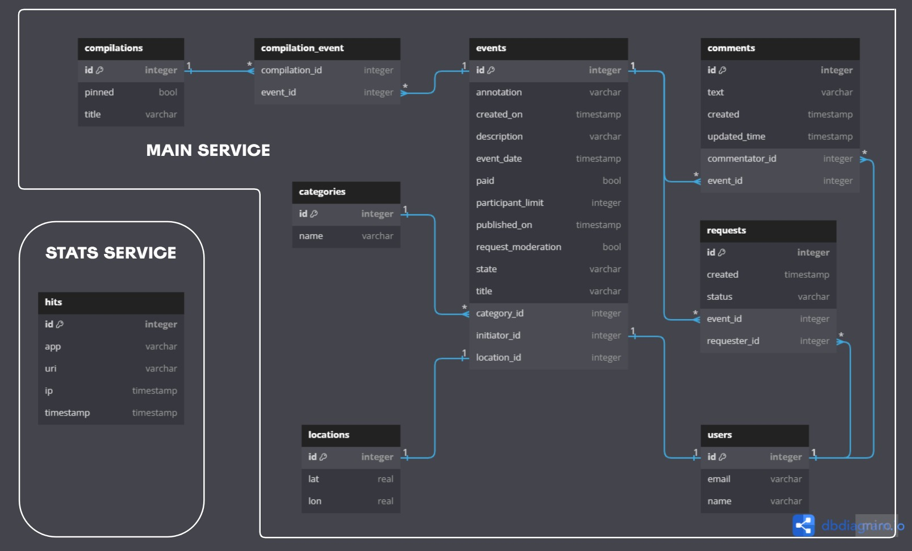

# ExploreWithMe

## Описание
**ExploreWithMe** - это приложение, которое позволяет пользователям делиться информацией об интересных событиях и находить компанию для участия в них. 

### Реализовано в виде двух микросервисов

1. **Основной сервис** `main-service-srv` - содержит всё необходимое для работы продукта и разделен на три части:
   - ***публичная*** -  доступна без регистрации любому пользователю сети и предоставляет возможность поиска и фильтрации событий
   
   - ***закрытая*** - доступна только авторизованным пользователям и позволяет:
       - добавлять в приложение новые мероприятия, редактировать их и просматривать после добавления
       - подавать заявки на участие в интересующих мероприятиях
       - создателю мероприятия подтверждать заявки, которые отправили другие пользователи

   - ***административная*** — для администраторов сервиса и позволяет им возможности настройки и поддержки работы приложения.

2. **Сервис статистики** `stats-service-srv` - собирает информацию о количестве обращений пользователей к спискам событий и о количестве запросов к подробной информации о событии. На основе этой информации формировывается статистика о работе приложения.

## Спецификация API

Для обоих сервисов имеются подробные спецификации API:
- спецификация основного сервиса: [ewm-main-service-spec.json](https://raw.githubusercontent.com/yandex-praktikum/java-explore-with-me/main/ewm-main-service-spec.json)  
- спецификация сервиса статистики: [ewm-stats-service.json](https://raw.githubusercontent.com/yandex-praktikum/java-explore-with-me/main/ewm-stats-service-spec.json).

Для работы с ними вам понадобится редактор [Swagger](https://editor-next.swagger.io/)

### Дополнительная функциональноть проекта

В дополнение к специфакции основного сервиса реализована дополнительная функциональность - возможность оставлять комментарии к событиям и модерировать их.

#### Функциональность эндпоинта /comments/{eventId} - публичный API

- **GET /comments/{eventId}?from={from}&size={size}** - получение комментариев к событию с идентификатором `eventId` незарегестрированными пользователями. Параметр `from` - номер первого выводимого элемента из списка (по умолчанию = 0), параметр `size` задает количество элементов для отображения (по умолчанию = 10)

#### Функциональность эндпоинта /users/{userId}/comments - закрытый API

- **POST /users/{userId}/comments/{eventId}** - добавление пользователем с идентификатором `userId` нового комментария к событию с идентификатором `eventId`

- **PATCH /users/{userId}/comments/{commentId}** - обновлене(редактирование) пользователем с идентификатором `userId` комментария с идентификатором `commentId`

- **DELETE /users/{userId}/comments/{commentId}** - удаление пользователем с идентификатором `userId` своего комментария с идентификатором `commentId`

#### Функциональность эндпоинта /admin/comments/{commentId} - административный API

- **DELETE /admin/comments/{commentId}** - удаление комментария с идентификатором `commentId` администратором сервиса

## Схема базы данных

База данных **основного сервиса** состоит из 8 таблиц, а база данных **сервиса статистики** - из 1 таблицы:  
**MAIN SERVICE**
| Название таблицы | Описание |
| --- | --- |
| **users** | таблица с пользователями |
| **categories** | таблица с категориями событий |
| **locations** | таблица с местоположениями событий |
| **events** | таблица с событиями |
| **requests** | таблица с запросами пользователей на участие в событии |
| **compilations** | таблица с подборками событий |
| **compilation_event** | таблица с событиями и соответствующими им подборками (many-to-many) |
| **comments** | таблица с комментариями к событиям |

**STATS SERVICE**
| Название таблицы | Описание |
| --- | --- |
| **hits** | таблица со статистикой обращений к основному API |
